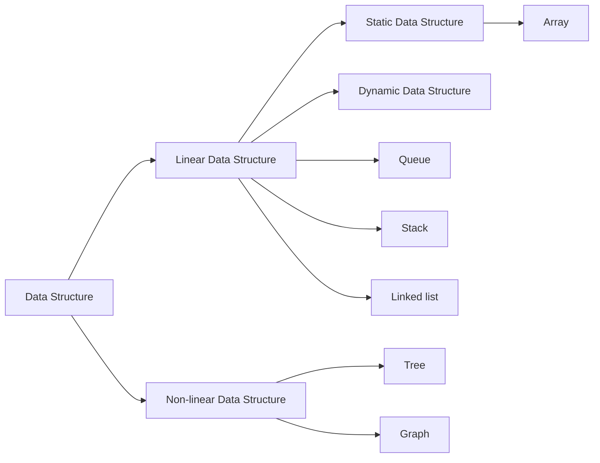
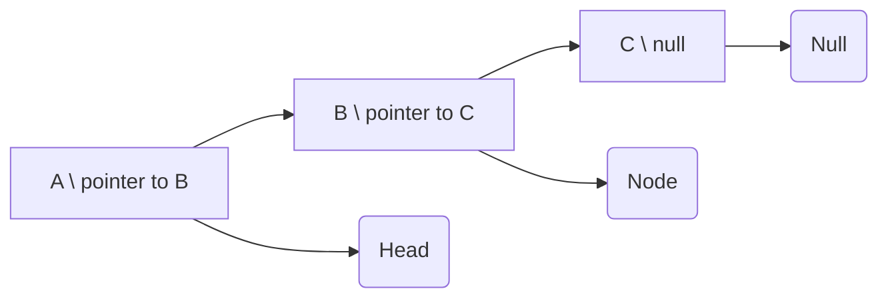

# Sumário

1. [Data Structures](#3-data-structures)

---

## 1. Data Structures

A data structure is a storage that is used to store and organize data. It is a way of arranging data on a computer so that it can be accessed and updated efficiently.

[🔗 What are Data Structures? | Illustrated Data Structures](https://youtu.be/9rhT3P1MDHk)

Data structures provide an easy way of organizing, retrieving, managing, and storing data.
Here is a list of the needs for data.

- Data structure modification is easy. 
- It requires less time. 
- Save storage memory space. 
- Data representation is easy. 
- Easy access to the large database.

### 1.1. Classification of Data Structure



|Type|Description|Example|
|---|---|---|
|Linear data structure|Data structure in which data elements are arranged sequentially or linearly, where each element is attached to its previous and next adjacent elements, is called a linear data structure|```array, stack, queue, linked list, etc```|
|Static data structure|Static data structure has a fixed memory size. It is easier to access the elements in a static data structure|```array```|
|Dynamic data structure|In the dynamic data structure, the size is not fixed. It can be randomly updated during the runtime which may be considered efficient concerning the memory (space) complexity of the code|```queue, stack, etc```|
|Non-linear data structure|Data structures where data elements are not placed sequentially or linearly are called non-linear data structures. In a non-linear data structure, we can’t traverse all the elements in a single run only|```trees and graphs```|

## 2. Arrays

- An array is a linear data structure and it is a collection of items stored at contiguous memory locations. It allows the processing of a large amount of data in a relatively short period. 
- The first element of the array is indexed by a subscript of 0.
- There are different operations possible in an array, like Searching, Sorting, Inserting, Traversing, Reversing, and Deleting.

```bash
            Memory Location
 200 201 202 203 204 205 206  .   .   . 
| U | B | F | D | A | E | C | . | . | . |
  0   1   2   3   4   5   6   .   .   .
```

```c
#include <stdio.h>

void main(){
    int myArray[] = {1, 2 ,3};

    printf("%p\n", &myArray);
    printf("%p\n", &myArray[0]); // decimal 140737488346012
    printf("%p\n", &myArray[1]); // decimal 140737488346016
    printf("%p\n", &myArray[2]); // decimal 140737488346020
    printf("\n");

    char myArrayChar[] = {'a','b','c'};

    printf("%p\n", &myArrayChar);
    printf("%p\n", &myArrayChar[0]); // decimal 140737488346021
    printf("%p\n", &myArrayChar[1]); // decimal 140737488346022
    printf("%p\n", &myArrayChar[2]); // decimal 140737488346023
    printf("\n");
}
```

### 2.1.  Characteristics of an Array

- Arrays use an index-based data structure which helps to identify each of the elements in an array easily using the index.
-If a user wants to store multiple values of the same data type, then the array can be utilized efficiently.
- An array can also handle complex data structures by storing data in a two-dimensional array.
- An array is also used to implement other data structures like Stacks, Queues, Heaps, Hash tables, etc.
- The search process in an array can be done very easily.

### 2.2. Applications of Array

- An array is frequently used to store data for mathematical computations.
- It is used in image processing.
- It is also used in record management.
- Book pages are also real-life examples of an array.
- It is used in ordering boxes as well.

### 2.3. Array operations

- Traversal: Traverse through the elements of an array.
- Insertion: Inserting a new element in an array.
- Deletion: Deleting element from the array.
- Searching:  Search for an element in the array.
- Sorting: Maintaining the order of elements in the array.

### 2.3. Algorithmic complexities

|||
|---|---|
|Accessing an element at index|constant ```O(1)```|
|Inserting at index|linear ```O(n)```|
|Deleting from index|linear ```O(n)```|
|Updating at index|constant ```O(1)```|
|Traversing the array|linear ```O(n)```|

## 3. Linked list:

A linked list is a linear data structure in which elements are not stored at contiguous memory locations. The elements in a linked list are linked using pointers.

Example: The "ABC" sequence:



### 3.1. Characteristics of a Linked list

- A linked list uses extra memory to store links.
- During the initialization of the linked list, there is no need to know the size of the elements.
- Linked lists are used to implement stacks, queues, graphs, etc.
- The first node of the linked list is called the Head.
- The next pointer of the last node always points to NULL.
- In a linked list, insertion and deletion are possible easily.
- Each node of the linked list consists of a pointer/link which is the address of the next node.
- Linked lists can shrink or grow at any point in time easily.

### 3.2. Applications of the Linked list

- A linked list is used in Round-Robin scheduling to keep track of the turn in multiplayer games.
- It is used in image viewer. The previous and next images are linked, and hence can be accessed by the previous and next buttons.
- In a music playlist, songs are linked to the previous and next songs. 

### 3.3. Algorithmic complexities

|||
|---|---|
|Inserting an element|constant ```O(1)```|
|Deleting an element|constant ```O(1)```|
|Traversing a linked list|linear ```O(n)```|
|Accessing an element|linear ```O(n)```|

### 3.4. Linked List in C

[🔗 Linked List](/2_data_structures/code/linked_list)

## 4. Stack

Stack is a linear data structure that follows a particular order in which the operations are performed. The order may be LIFO(Last In First Out) or FILO(First In Last Out).

```Bash

| C | --↴         ↱-- | C |

Top ->|   |     |   |
      | B |     | B |<- Top
      | A |     | A |

    Stack Data Structure
```

### 4.1. Applications of Stack

Consider an example of plates stacked over one another in the canteen. The plate which is at the top is the first one to be removed, i.e. the plate which has been placed at the bottommost position remains in the stack for the longest period of time. So, it can be simply seen to follow LIFO(Last In First Out)/FILO(First In Last Out) order.

### 4.2. Basic Operations on Stack

- ```push()``` to insert an element into the stack
- ```pop()``` to remove an element from the stack
- ```top()``` Returns the top element of the stack.
- ```isEmpty()``` returns true if stack is empty else false.
- ```size()``` returns the size of stack.

### 4.3. Algorithmic complexities

|||
|---|---|
|```push()```|constant ```O(1)```|
|```pop()  ```|constant ```O(1)```|
|```isEmpty() ```|constant ```O(1)```|
|```size()```|constant ```O(1)```|

### 4.4. Stack in C

[🔗Stack](/2_data_structures/code/stack.c)

## 5. Queue 

We define a queue to be a list in which all additions to the list are made at one end, and all deletions from the list are made at the other end.  The element which is first pushed into the order, the operation is first performed on that.

```Bash
            ⇃Front/Head         ⇃Back  | 9 | 
Dequeue ⮦---| 3 | 4 | 5 | 6 | 7 | 8 |---↲ Enqueue
      | 2 |
```

### 5.1. Applications of Queue

Application of queue is common. In a computer system, there may be queues of tasks waiting for the printer, for access to disk storage, or even in a time-sharing system, for use of the CPU. Within a single program, there may be multiple requests to be kept in a queue, or one task may create other tasks, which must be done in turn by keeping them in a queue.

It has a single resource and multiple consumers.
It synchronizes between slow and fast devices.
In a network, a queue is used in devices such as a router/switch and mail queue.
Variations: dequeue, priority queue and double-ended priority queue.

### 5.2. Basic Operations on Queue

- ```enqueue()``` adds (or stores) an element to the end of the queue.
- ```dequeue()``` removes (or access) the first element from the queue.
- ```front()``` returns the element at the front end without removing it.
- ```rear()``` returns the element at the rear end without removing it.
- ```isEmpty()``` returns a boolean value that indicates whether the queue is empty or not.
- ``` isFull()``` returns a boolean value that indicates whether the queue is full or not.

### 5.3 . Queue in C

Like stacks, Queues can also be represented in an array: In this representation, the Queue is implemented using the array. Variables used in this case are

- Queue: the name of the array storing queue elements.
- Front: the index where the first element is stored in the array representing the queue.
- Rear: the index where the last element is stored in an array representing the queue.

```c
// Creating an empty queue
 
// A structure to represent a queue
struct Queue {
    int front, rear, size;
    unsigned capacity;
    int* array;
};
 
// function to create a queue of given capacity
// It initializes size of queue as 0
struct Queue* createQueue(unsigned capacity)
{
    struct Queue* queue
        = (struct Queue*)malloc(sizeof(struct Queue));
    queue->capacity = capacity;
    queue->front = queue->size = 0;
    queue->rear = capacity - 1;
    queue->array
        = (int*)malloc(queue->capacity * sizeof(int));
    return queue;
}
 
// This code is contributed by Susobhan Akhuli
```

## 6. Hash Table

There are majorly three components of hashing:

1. Key: A Key can be anything string or integer which is fed as input in the hash function the technique that determines an index or location for storage of an item in a data structure. 
2. Hash Function: The hash function receives the input key and returns the index of an element in an array called a hash table. The index is known as the hash index.
3. Hash Table: Hash table is a data structure that maps keys to values using a special function called a hash function. Hash stores the data in an associative manner in an array where each data value has its own unique index

Python dictionaries are hash table data structures 


### 6.1. Applications of Hash Table

Price fruits:

```python
price_fruits = {
    "Apples": 5,
    "Oranges": 3,
    "Grapes": 7,
    "Melon": 9,
    "Kiwi": 2
}
```

### 6.2. Algorithmic complexities

|||
|---|---|
|```set()```|constant ```O(1)```|
|```get()```|constant ```O(1)```|
|```delete() ```|constant ```O(1)```|
|```size()```|constant ```O(1)```|
|```clear()```|constant ```O(1)```|

### 7. Tree

This data structure is a specialized method to organize and store data in the computer to be used more effectively. It consists of a central node, structural nodes, and sub-nodes, which are connected via edges. We can also say that tree data structure has roots, branches, and leaves connected with one another. HTML works like a tree.